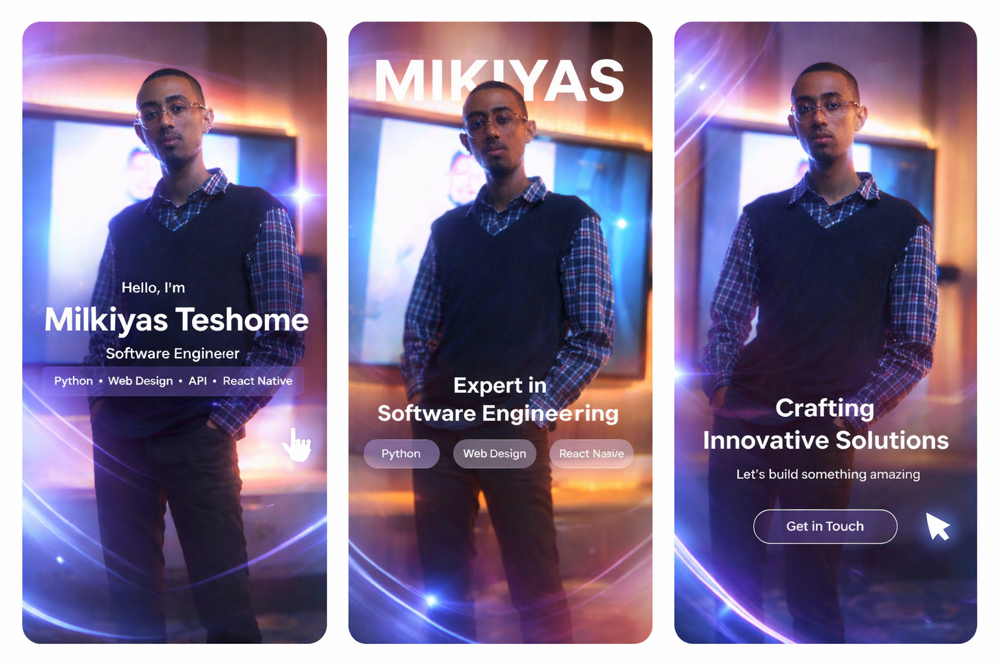

# Hi there 👋, I'm Mikiyas Teshome

**Full-Stack Software Engineer | AI Developer | Content Creator**

I’m a passionate software engineer with a focus on AI, web, and mobile development. I build innovative applications that combine high performance with user-friendly design. From Ethiopia to the world, I aim to make an impact through technology and creative content.

  <a href="https://mikiyas-teshome67.github.io/my-portfolio/">
    🌐 Portfolio Website
  </a>

**linkdin Porfolio: 
---

## 🚀 Skills & Technologies

**Programming Languages:** , , 
, 
, 
, .

**Frameworks & Libraries:** 
,,, , .

**Tools & Platforms:** ,, , , .

**AI & ML:** , ,,,,,,.

**Databases:** ,,,,.

**Reverse Engineering And Binary Analysis :** ,,,,,

---

## 💼 Experience

I have successfully delivered multiple projects on **Upwork** and personal ventures including:  

- **Generative AI App** – Ethiopia’s first generative AI project.  

- **Disease Detection Tool** – Python-based AI for medical diagnostics.  

- **Portfolio Web Apps** – High-performance web apps combining front-end and back-end.  

- Contributed to open-source projects showcasing advanced AI, web, and mobile solutions.

---

## 📺 Socials & Content

I also create viral tech and edit content on YouTube & TikTok:  

- **YouTube:** [MikiyasTT_Edits](https://www.youtube.com/@MikiyasTT_Edits)  

- **TikTok:** [@mikiyastt_edits](https://www.tiktok.com/@mikiyastt_edits)

- **Email:** [mikiyasteshome749](mikiyasteshome749@gmail.com)    

Follow me for coding tutorials, AI experiments, and viral edits!

---

## 📂 Featured Projects

| Project | Tech Stack | Description |
|---------|------------|-------------|
| [YScroll Landing Website](https://github.com/Mikiyas-Teshome67/yscroll-landing-website) | HTML, CSS, JS | Smooth scrolling landing page with modern UI |
| [Disease Detection Tool](https://github.com/Mikiyas-Teshome67/disease-detection) | Python, TensorFlow | AI-powered disease detection from images |
| [Generative AI App](https://github.com/Mikiyas-Teshome67) | Python, Node.js | Ethiopia’s first generative AI project |
| [Portfolio Apps](https://github.com/Mikiyas-Teshome67) | Flutter, React | Mobile & web apps showcasing my skills |

---

## 📈 GitHub Stats

## 📊 GitHub Most Used Languages

## 💪 Contribution Streak

## 🧠 GitHub Commit Activity Graph

---

## ⚡ Fun Fact

I combine **AI coding** with **creative edits**, making tech visually engaging and interactive. When I’m not coding, I’m creating viral YouTube and TikTok content!

---

> “Building tech that matters, creating content that inspires.” – **Mikiyas Teshome**
